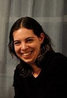

<audio preload id="audio" oncanplay="document.getElementById('playbutton').style.display = 'inline-block';">
	<source src="hadaskotek.ogg" type="audio/ogg"/>
	<source src="hadaskotek.mp3" type="audio/mp3"/>
</audio>

Hadas Kotek 
===========

	McGill University 
	Department of Linguistics 
	1085 Dr. Penfield, Room 101 
	Montreal, Quebec H3A 1A7, Canada
	
[hadas.kotek@mcgill.ca](mailto:hadas.kotek@mcgill.ca)
	
About me
--------

I am a Mellon Postdoctoral Fellow in Linguistics at [McGill University](https://www.mcgill.ca/linguistics/department-linguistics). I received my PhD from the [Department of Linguistics and Philosophy at MIT](http://web.mit.edu/linguistics/). [My dissertation](http://ling.auf.net/lingbuzz/002231/current.pdf?_s=mFXst8rtWr5B1Rhc) proposes a new syntax-semantics for *wh*-questions, focusing mostly on English and German questions, and presenting evidence from offline judgments as well as online sentence processing. More recently, I have been expanding my work to the understudied languages Chuj (Mayan) and Tibetan. I have also been working on a new theory of intervention effects in *wh*-questions, and using them as a diagnostic of the underlying structure of questions, Association with Focus constructions, and relative clauses. To read more about these projects and others, visit my [research page](www.hkotek.com/research).

Research interests
------------------

**Broad interests**: The syntax-semantics interface; Experimental approaches to syntax and semantics. 

**Narrow interests**: The architecture of Grammar: 

* Scope taking using movement and focus alternatives
* Derivational economy and derivational timing
* Questions, pied-piping, and wh-indefinites
* Focus and quantifier-induced intervention effects
* Relative clauses and free relatives
* Degree semantics, comparatives, superlatives, and numerals
 
For an updated list of my presentations and publications, please consult [my CV](KotekCV.pdf).

Recent and upcoming
-------------------

* **New paper appeared online:** Erlewine, Michael Yoshitaka and Hadas Kotek. [**A streamlined approach to online linguistic surveys**](http://link.springer.com/article/10.1007/s11049-015-9305-9). *Natural Language & Linguistic Theory*. DOI: 10.1007/s11049-015-9305-9 (includes an online Appendix). Tools available at: [turktools.net](turktools.net).

* **New paper in press:** Kotek, Hadas, Yasutada Sudo, and Martin Hackl. [**Experimental investigations of ambiguity: The case of *most***](http://semanticsarchive.net/Archive/TliOGUyM/most-final.pdf). *Natural Language Semantics* 23(2): 119-156. DOI: 10.1007/s11050-015-9113-0.

* **New paper:** Erlewine, Michael Yoshitaka and Hadas Kotek. [**The structure and interpretation of non-restrictive relatives: Evidence from relative pronoun pied-piping**](Erlewine_Kotek-cls51.pdf). To appear in *Proceedings of CLS 51* ([slides](Erlewine-kotek-relp-cls2015.pdf)).

* **On the semantics of *wh*-questions**. *Presentation at the Israeli Association for Theoretical Linguistics (IATL) 31*, Bar-Ilan University, Israel, October 2015.

* ***Wh*-quantification in Dharamsala Tibetan**. *Presentation at the  37th International Conference of the Linguistic Society of India (ICOLSI-37)*,  Jawaharlal Nehru University, New Delhi, India, October 2015 (with Michael Yoshitaka Erlewine).

* **On the semantics of *wh*-questions**. *Presentation at Sinn und Bedeutung (SuB) 20*, Tübingen, Germany, September 2015.

* **Relative pronoun pied-piping, the structure of which informs the analysis of relative clauses**. *Presentation at Sinn und Bedeutung (SuB) 20*, Tübingen, Germany, September 2015 (with Michael Yoshitaka Erlewine).

* **Pervasive intervention and the architecture of Grammar**. Generative Syntax in the Twenty-first Century: The Road Ahead, Athens, Greece, May, 2015. (poster)

* **Intervention everywhere!** ([handout,](Kotek-intervention-everywhere-handout.pdf) [slides](Kotek-intervention-everywhere-slides.pdf)). *Presentation at GLOW 38*, Paris, April 2015.

* **Against a feature driven view of *wh*-movement** ([slides](Kotek-covert-scrambling-slides.pdf)). *Presentation at the Deutsche Gesellschaft für Sprachwissenschaft (DGfS) 37*, workshop: What drives syntactic computation? Alternatives to formal features, Leipzig, March 2015.
